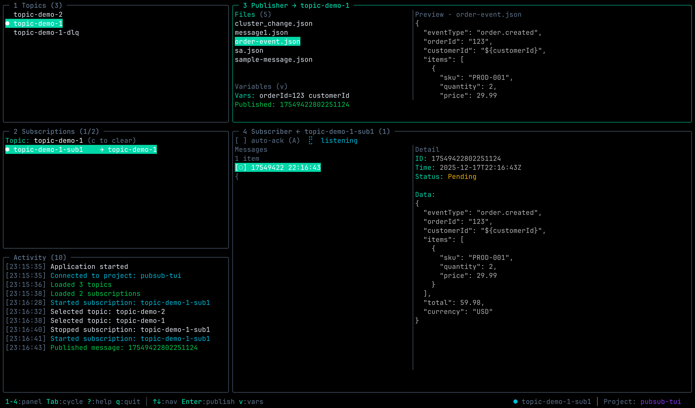

# Google Cloud Pub/Sub TUI

A Terminal User Interface (TUI) for managing Google Cloud Pub/Sub resources, built with Go and [BubbleTea](https://github.com/charmbracelet/bubbletea).


## Features

- 🎯 **Interactive Terminal UI** - Full keyboard-driven interface with vim-style navigation
- 📋 **Topic & Subscription Management** - List, create, delete, and filter topics and subscriptions
- 📤 **Message Publishing** - Publish messages with JSON templates and variable substitution
- 📥 **Real-time Message Subscription** - Receive and view messages in real-time
- ✅ **Message Acknowledgment** - Manual or automatic message acknowledgment
- 🔍 **Regex Filtering** - Filter topics, subscriptions, and messages using regex patterns
- 📊 **Activity Logging** - View all operations with color-coded log levels
- 🎨 **Beautiful UI** - Modern styling with [Lipgloss](https://github.com/charmbracelet/lipgloss)

## Screenshots



## Installation

### Prerequisites

- **Go 1.20+**
- **Google Cloud SDK** (gcloud CLI)
- **GCP Project** with Pub/Sub API enabled
- **Authentication** configured (see below)

### Build from Source

```bash
git clone <repository-url>
cd pubsub-tui2
go build -o pubsub-tui
./pubsub-tui
```

### Quick Install

```bash
go install github.com/yourusername/pubsub-tui@latest
```

## Setup

### 1. Configure GCP Project

Set your project ID:

```bash
# Option 1: Environment variable
export GOOGLE_CLOUD_PROJECT=your-project-id

# Option 2: gcloud configuration
gcloud config set project your-project-id
```

### 2. Authenticate

```bash
# Application Default Credentials (recommended)
gcloud auth application-default login

# Or use a service account
export GOOGLE_APPLICATION_CREDENTIALS=/path/to/service-account-key.json
```

### 3. Enable Pub/Sub API

```bash
gcloud services enable pubsub.googleapis.com
```

### 4. Verify Permissions

Your user/service account needs these IAM roles:
- `roles/pubsub.editor` (or individual permissions)

## Using the Pub/Sub Emulator

For local development and testing, you can use the Google Cloud Pub/Sub emulator instead of connecting to real GCP resources. The application automatically detects when the emulator is configured and adjusts its behavior accordingly (no GCP authentication required).

### 1. Start the Emulator

```bash
# Install the emulator component (one-time)
gcloud components install pubsub-emulator

# Start the emulator
gcloud beta emulators pubsub start --host-port=localhost:8085
```

### 2. Configure Environment Variables

In a new terminal, set the required environment variables:

```bash
# Point to the emulator (required)
export PUBSUB_EMULATOR_HOST=localhost:8085

# Set a project ID (required - can be any string for the emulator)
export GOOGLE_CLOUD_PROJECT=local-project
```

Or use the helper command to get the environment variables:

```bash
$(gcloud beta emulators pubsub env-init)
export GOOGLE_CLOUD_PROJECT=local-project
```

### 3. Run the Application

```bash
./pubsub-tui
```

The application will display a message indicating it's connecting to the emulator.

### Emulator Notes

- Topics and subscriptions created in the emulator are ephemeral and lost when the emulator stops
- No GCP credentials or permissions are required
- The emulator supports most Pub/Sub operations but may have some limitations compared to the real service
- Useful for testing message flows without incurring GCP costs

## Usage

### Starting the Application

```bash
./pubsub-tui
```

The application will verify your credentials and connect to your GCP project.

### Navigation

| Key | Action |
|-----|--------|
| `Tab` | Cycle focus between panels |
| `Shift+Tab` | Cycle focus backward |
| `1-4` | Jump to panel (Topics/Subscriptions/Publisher/Subscriber) |
| `q` or `Ctrl+C` | Quit application |
| `?` | Show help |

### Topics Panel (Panel 1)

| Key | Action |
|-----|--------|
| `↑`/`↓` or `j`/`k` | Navigate list |
| `Enter` | Select topic (filters subscriptions, sets publish target) |
| `n` | Create new topic |
| `d` | Delete selected topic |
| `/` | Filter by regex |
| `Esc` | Clear filter |

### Subscriptions Panel (Panel 2)

| Key | Action |
|-----|--------|
| `↑`/`↓` or `j`/`k` | Navigate list |
| `Enter` | Start/stop subscription (receive messages) |
| `n` | Create new subscription |
| `d` | Delete selected subscription |
| `/` | Filter by regex |
| `Esc` | Clear filter |

### Publisher Panel (Panel 3)

| Key | Action |
|-----|--------|
| `↑`/`↓` or `j`/`k` | Navigate JSON files |
| `Enter` | Publish message to selected topic |
| `v` | Edit variables for substitution |

**Variable Substitution:**
- Use `${variableName}` in JSON files
- Set variables: `key1=value1 key2=value2`
- Example:
  ```json
  {
    "user": "${user}",
    "environment": "${env}"
  }
  ```
  With variables: `user=alice env=production`

### Subscriber Panel (Panel 4)

| Key | Action |
|-----|--------|
| `↑`/`↓` or `j`/`k` | Navigate messages |
| `Enter` | View message details |
| `a` | Acknowledge selected message |
| `A` | Toggle auto-acknowledge mode |
| `/` | Filter messages by regex |
| `Ctrl+d`/`Ctrl+u` | Scroll message detail view |

## Message Templates

Place JSON files in the working directory where you run `pubsub-tui`. They will be automatically loaded in the Publisher panel.

Example (`order-event.json`):
```json
{
  "orderId": "${orderId}",
  "userId": "${userId}",
  "environment": "${env}",
  "timestamp": "2024-01-15T10:30:00Z",
  "items": [
    {
      "product": "Widget",
      "quantity": 5
    }
  ]
}
```

Set variables in Publisher: `orderId=12345 userId=user-001 env=production`

## Architecture Documentation

This project uses **The Elm Architecture (MVU)** pattern via BubbleTea. New to TUI development? Start here:

### 📚 Documentation

| Document | Description | Audience |
|----------|-------------|----------|
| **[ARCHITECTURE_QUICK_START.md](./ARCHITECTURE_QUICK_START.md)** | Quick introduction with examples | New TUI developers |
| **[ARCHITECTURE_DIAGRAMS.md](./ARCHITECTURE_DIAGRAMS.md)** | Visual diagrams of data flow | Visual learners |
| **[ARCHITECTURE.md](./ARCHITECTURE.md)** | Complete architecture deep dive | Experienced developers |
| **[REQUIREMENTS.md](./REQUIREMENTS.md)** | Full requirements specification | Product/QA teams |

### Key Concepts

The application follows these principles:

1. **Model-View-Update (MVU)**: Functional architecture with unidirectional data flow
2. **Message Passing**: Components communicate via messages, not direct calls
3. **Commands for Side Effects**: All I/O operations wrapped in async commands
4. **Immutable State**: State changes only in Update function
5. **Pure View Functions**: Rendering has no side effects

**Quick Example:**

```
User presses Enter → KeyMsg → Update → Model changes → View renders
                                  ↓
                            (Returns Command)
                                  ↓
                          Async operation (API call)
                                  ↓
                          Result as Message
                                  ↓
                          Update handles result
```

See [ARCHITECTURE_QUICK_START.md](./ARCHITECTURE_QUICK_START.md) for a complete walkthrough.

## Project Structure

```
pubsub-tui/
├── main.go                      # Application entry point
├── internal/
│   ├── app/                     # Main application coordinator (MVU root)
│   │   ├── app.go               # Model and initialization
│   │   ├── update.go            # State transitions
│   │   └── view.go              # Layout and rendering
│   ├── components/              # UI components (each follows MVU)
│   │   ├── topics/              # Topics panel
│   │   ├── subscriptions/       # Subscriptions panel
│   │   ├── publisher/           # Publisher panel
│   │   ├── subscriber/          # Subscriber panel
│   │   ├── activity/            # Activity log panel
│   │   └── common/              # Shared messages and styles
│   ├── pubsub/                  # GCP Pub/Sub business logic
│   │   ├── client.go            # Client wrapper
│   │   ├── topics.go            # Topic operations
│   │   ├── subscriptions.go     # Subscription operations
│   │   ├── publisher.go         # Publishing logic
│   │   └── subscriber.go        # Subscription streaming
│   └── utils/                   # Utility functions
└── testdata/                    # Sample message templates
```

## Technology Stack

- **[BubbleTea](https://github.com/charmbracelet/bubbletea)**: TUI framework (MVU pattern)
- **[Bubbles](https://github.com/charmbracelet/bubbles)**: Pre-built TUI components
- **[Lipgloss](https://github.com/charmbracelet/lipgloss)**: Terminal styling
- **[Google Cloud Go SDK](https://cloud.google.com/go)**: Pub/Sub client library

## Development

### Running in Development

```bash
# Build and run
go run main.go

# With specific project
GOOGLE_CLOUD_PROJECT=my-project go run main.go

# Build for production
go build -ldflags="-s -w" -o pubsub-tui
```

### Adding a New Component

1. Create `internal/components/mycomponent/`
2. Add `model.go`, `update.go`, `view.go`
3. Follow MVU pattern (see existing components)
4. Register in `app.Model`
5. Handle messages in `app.Update`
6. Render in `app.View`

See [ARCHITECTURE.md](./ARCHITECTURE.md) for detailed guidance.

### Debugging

The TUI uses alt-screen mode, so you can't use `fmt.Println()`. Options:

1. **Activity Log**: Show logs in UI
   ```go
   return m, func() tea.Msg {
       return common.Info("Debug message")
   }
   ```

2. **Log to File**:
   ```go
   f, _ := os.OpenFile("debug.log", os.O_APPEND|os.O_CREATE|os.O_WRONLY, 0644)
   fmt.Fprintf(f, "Debug: %#v\n", someValue)
   ```

3. **Use Delve** with a separate terminal

## Troubleshooting

### "Error: GCP project ID not found"

```bash
# Set project
export GOOGLE_CLOUD_PROJECT=your-project-id
# or
gcloud config set project your-project-id
```

### "Authentication error"

```bash
# Re-authenticate
gcloud auth application-default login
```

### "Permission denied" errors

Check your IAM permissions:
```bash
gcloud projects get-iam-policy your-project-id \
  --flatten="bindings[].members" \
  --filter="bindings.members:user:your-email@example.com"
```

You need `roles/pubsub.editor` or equivalent permissions.

### UI looks broken

- Ensure terminal supports 256 colors
- Minimum terminal size: 80x24 (recommended: 120x30+)
- Try a different terminal emulator (iTerm2, Windows Terminal, etc.)

## Examples

### Publishing a Message

1. Select a topic in the Topics panel (Panel 1)
2. Press `3` to jump to Publisher panel
3. Navigate to a JSON file
4. Press `v` to set variables (if using templates)
5. Press `Enter` to publish
6. Check Activity Log for confirmation

### Receiving Messages

1. Select a topic in the Topics panel (Panel 1)
2. Press `2` to jump to Subscriptions panel
3. Select a subscription for that topic
4. Press `Enter` to start receiving
5. Press `4` to jump to Subscriber panel
6. View incoming messages in real-time
7. Press `a` to acknowledge individual messages
8. Or press `A` to toggle auto-acknowledge

### Creating a Topic and Subscription

1. Press `1` to jump to Topics panel
2. Press `n` (new)
3. Enter topic name: `my-new-topic`
4. Press `2` to jump to Subscriptions panel
5. Select the new topic first (so it's the target)
6. Press `n` (new)
7. Enter subscription name: `my-new-subscription`
8. The subscription is now linked to the topic

## Contributing

Contributions welcome! Please:

1. Read [ARCHITECTURE.md](./ARCHITECTURE.md) to understand the design
2. Follow the MVU pattern for new components
3. Add tests for business logic
4. Keep UI components separate from business logic
5. Use message passing for component communication

## License

MIT License - see LICENSE file for details

## Acknowledgments

- [Charm](https://charm.sh/) for the excellent TUI frameworks
- [Google Cloud](https://cloud.google.com/) for the Pub/Sub service
- The Go community for amazing tools and libraries

## Support

- **Issues**: GitHub Issues
- **Discussions**: GitHub Discussions
- **Documentation**: See docs/ folder

---

**Happy Terminal UI-ing! 🚀**


